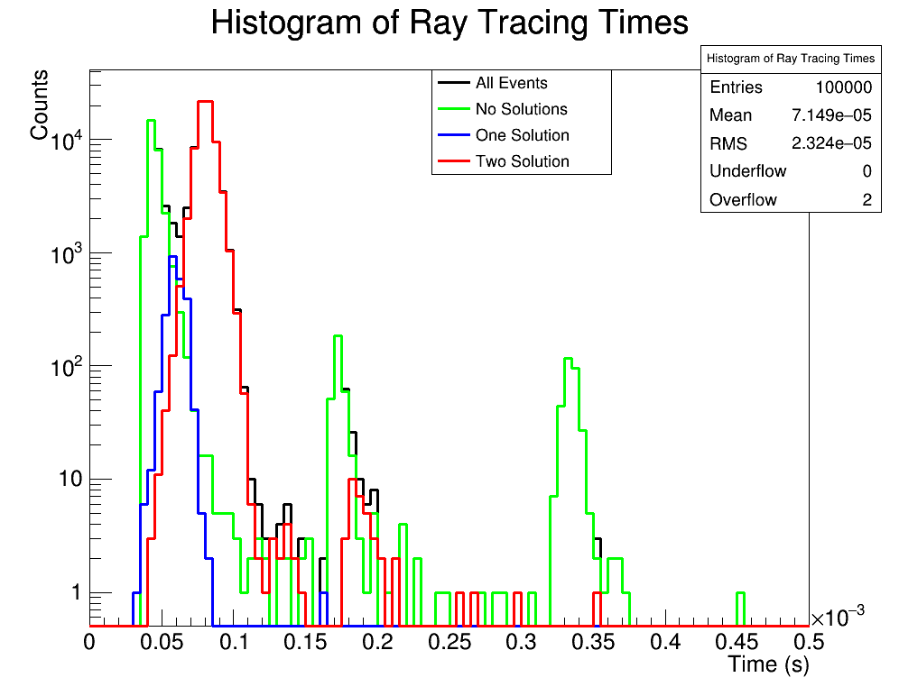

# T04cpp_speed
profile the speed of the cpp ray tracer

## Prerequisites
You will need to have a functioning installation of [GSL](https://www.gnu.org/software/gsl/) ([1.16](https://ftp.gnu.org/gnu/gsl/gsl-1.16.tar.gz) is verified to work).
- You will need to set the enviromnent variable `GSLDIR` to your local installation of GSL.
- You will also need to have `GSLDIR` in your `LD_LIBRARY_PATH`.

You will also need to have a functioning installation of ROOT. ROOT5 or 6 is fine. Make sure to call `source thisroot.sh` ahead of time.

##Building and Running

Getting going is easy. Just:
- Make it: `make analytic_raytracing`
- Run it: `./analytic_raytracing`
- The main is at the bottom of the code, which loops over many combinations of emitter and receivers and stores the time for each.

You might need to update the Makefile to point directly to your installation of the NuRadioMC utilities. The result should look something like the following:

