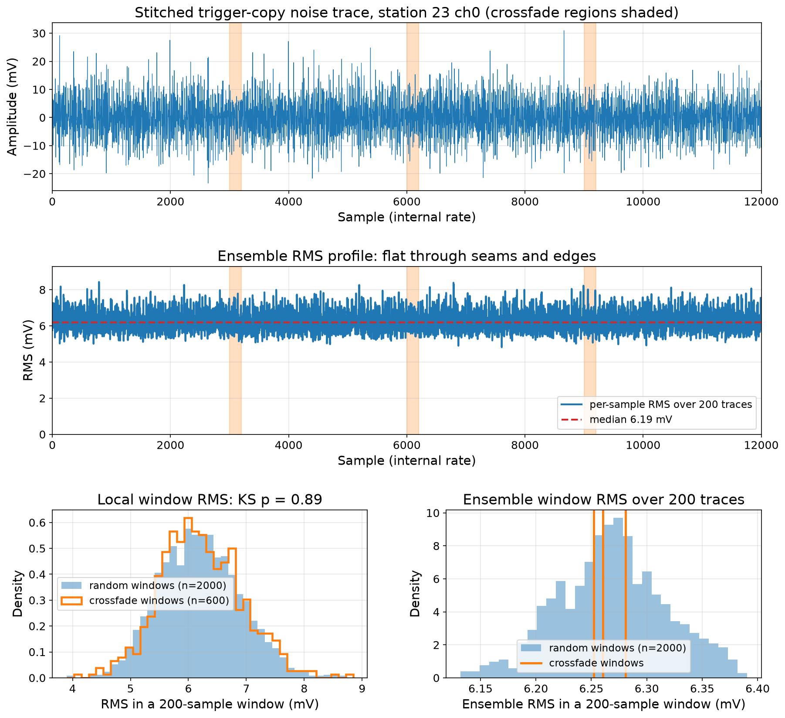

# RNO-G trigger simulation with FLOWER trigger model

General-purpose RNO-G simulation with a FLOWER trigger model and two noise modes (thermal and measured forced-trigger).

## Table of contents

- [Overview](#overview)
- [Files](#files)
- [Noise modes](#noise-modes)
- [FLOWER trigger model](#flower-trigger-model)
- [ADC pedestal and asymmetric saturation](#adc-pedestal-and-asymmetric-saturation)
- [CR proxy configuration](#cr-proxy-configuration)
- [Usage](#usage)
- [CLI arguments](#cli-arguments)
- [Output](#output)
- [Known limitations](#known-limitations)
- [Framework changes on this branch](#framework-changes-on-this-branch)

## Overview

`simulate.py` wraps the NuRadioMC simulation framework with three features:

1. **Measured noise injection.** Real forced-trigger (FT) waveforms replace synthetic thermal noise via `--ft_noise_dir`. See [noise modes](#noise-modes).

2. **Asymmetric ADC saturation.** Models the off-center pedestal bias of the RADIANT ADC. Clipping is per-channel from measured pedestals via `--clip_thresholds <yaml>` (the shipped per-station YAMLs carry measured 2022 bounds); `--pedestal_voltage` is the uniform-clip fallback. See [ADC pedestal](#adc-pedestal-and-asymmetric-saturation) and [`pedestal_extraction/`](pedestal_extraction/).

3. **FLOWER trigger model.** `triggerBoardResponse` + `highLowThreshold`. First-pass approximation; see [known limitations](#known-limitations).

All three are optional. Without `--ft_noise_dir`, thermal noise is used. Without `--pedestal_voltage`, the ADC range is symmetric. The FLOWER trigger is always active.

Note: the shipped production configuration (electron-neutrino NC events, a near-surface 200 m fiducial volume, half-decade shower energies 10^16-10^19 eV) is set up for cosmic-ray proxy simulation. Each of those is a config/CLI choice, not a property of the machinery - modify them as needed for other uses, and see [CR proxy configuration](#cr-proxy-configuration) for what the CR-proxy values are and why.

## Data requirements

Measured-noise mode needs standard RNO-G full-waveform run data (`station{id}_run*.root`) for the station and year, obtained through normal collaboration data access; the pool selects `FORCE` events itself, so no pre-filtering is needed. The detector description comes from MongoDB (default) or a `--detector_file`. The shipped clean masks, trigger vrms, and ADC clip thresholds are measured 2022 values (detector epoch 2022-10-01); the `trigger_vrms_station{13,23}_calibrated.yaml` files pair with the calibrated season-2022 readout detector description. Other years, stations, or detector epochs need re-derivation with the tools in `noise_analysis/` and `pedestal_extraction/`. See [`production/`](production/) for running at scale.

## Files

| File | Description |
|------|-------------|
| `simulate.py` | Simulation script supporting thermal and FT noise modes |
| `RNO_config.yaml` | Default NuRadioMC config (`noise: False` for FT mode) |
| [`noise_analysis/`](noise_analysis/) | FT noise cleaning (clean mask) and trigger-path Vrms extraction |
| [`pedestal_extraction/`](pedestal_extraction/) | ADC pedestal extraction from `pedestal.root` files, produces per-channel clip thresholds |

## Noise modes

### Thermal (default)

Without `--ft_noise_dir`, the framework generates noise from a temperature model through the signal chain response. The default config uses 300 K, configurable via `trigger.noise_temperature` in the YAML (or `"detector"` for per-channel values from the detector description).

### Measured FT noise (`--ft_noise_dir`)

FT waveforms are recorded through the readout signal chain (RADIANT, 3.2 GHz). The trigger path uses a different signal chain after the 3 dB splitter (arXiv:2411.12922, Sec. 3.2). So FT noise must be injected differently for each path, implemented in-script:

1. **Trigger path** (at 5 GHz internal sim rate): the internal trigger trace is much longer than one FT event (padded to ~2 us for linear convolution), so several FT events are each upsampled from 3.2 to 5 GHz and stitched into one continuous noise trace with an equal-power crossfade (`tile_noise_overlap_add`, `TILE_OVERLAP` samples of overlap). The stitched noise is multiplied by a transfer function (`trigger_response / readout_response`, from the detector description) to convert from readout to trigger domain, then added to the trigger channel copies (ch 0-3), so the trigger is always evaluated on signal plus noise.

2. **Readout path** (at 3.2 GHz): a separate FT event is added directly to the readout channels at native rate, after the readout-window cut and resample. No transform is needed since the noise was recorded through the readout chain.

The two paths draw independent FT realizations from the same streaming pool (the trigger tiles and the readout event are different draws). The config must set `noise: False` to prevent the framework from also adding thermal noise on top of the injected FT noise.

The crossfade uses equal-power sqrt-Hann weights (head^2 + tail^2 = 1 at every overlap sample), so the summed variance of independent tiles stays constant through each seam; the outermost edges carry full amplitude. On real station-23 FT data this reproduces the near-threshold noise-only trigger probability of an ideal seamless noise fill within measurement errors.



The figure shows one stitched trace with the crossfade regions shaded; the per-sample RMS over 200 stitched traces, flat through every seam and both edges; and the evidence that crossfade regions are statistically identical to the rest of the trace: the local-RMS distribution of all crossfade windows lies on top of the random-window distribution (KS test in the panel title), and every seam's ensemble RMS sits inside the random-window spread. Regenerate it for any station with `noise_analysis/plot_tiling_example.py --ft_noise_dir <dir> --station <id> [--clean_mask <npz>]`.

The readout window is cut with a zero-padded cutter (`zero_padded_readout_window_cutter`) that replaces the framework's cyclic roll: when the readout window extends past the internal trace edge, the overflow is filled with zeros rather than wrapped. In FT mode the zeros are then covered by the readout FT injection, which spans the full 2048-sample readout trace.

Point `--ft_noise_dir` at a directory of `station{id}_run*.root` ROOT files. To exclude non-thermal FT events, pass `--ft_clean_mask` with an NPZ mask file (`runNum`/`eventNum`/`is_clean`) from [`noise_analysis/ft_cleaning/`](noise_analysis/ft_cleaning/). A pool smaller than `--n_events` simply reuses realizations (the file list is cycled and reshuffled).

## FLOWER trigger model

`triggerBoardResponse` (VGA gain + 8-bit ADC) followed by `highLowThreshold`:

- Threshold: ~3.76 sigma at 1 Hz rate
- Coincidence: 2-fold across PA channels 0-3
- High-low window: 6 samples at FLOWER rate (~472 MSa/s)
- Coincidence window: 20 samples at FLOWER rate

In FT mode, the trigger-path Vrms is loaded from a YAML file (`--trigger_vrms`). In thermal mode, it is computed from the noise temperature and the trigger signal chain response. See [`noise_analysis/trigger_vrms/`](noise_analysis/trigger_vrms/) for extraction and limitations.

## ADC pedestal and asymmetric saturation

The RADIANT ADC digitizes a 0-2.5V range. The pedestal bias sits at ~1.5V, off-center from the 1.25V midpoint, making the effective clip range asymmetric in pedestal-subtracted coordinates: [-1500, +1000] mV for a 1.5V pedestal.

`--clip_thresholds <yaml>` applies per-channel asymmetric bounds `{ch: [lo_mV, hi_mV]}` from measured pedestals; the shipped `pedestal_extraction/clip_thresholds_station{NN}.yaml` carry measured 2022 values. `--pedestal_voltage` is the uniform fallback (a single value for all channels) when no clip file is given. See [`pedestal_extraction/`](pedestal_extraction/).

## CR proxy configuration

The machinery here is general purpose, but the shipped production configs generate
cosmic-ray proxy datasets: in-ice cascades standing in for the energy that cosmic-ray
air-shower cores deposit just below the ice surface (Coleman et al., arXiv:2410.08615).
The specific choices and why:

- **`flavor: e`, `interaction_type: nc`.** A neutral-current interaction leaves a single
  hadronic cascade at the vertex with no outgoing lepton signature - the generator's
  closest analog of a compact deposited shower core. The thrown energy is the
  shower-scale (deposited) energy, not a cosmic-ray primary energy; the mapping to
  primary energy and all flux weighting happen downstream in analysis, using the
  zenith-dependent deposited-energy flux of Coleman et al.
- **`fiducial_rmax: 200`.** Passing `--fiducial_rmax` selects the CR fiducial volume
  (`get_fiducial_volume_cr`): vertices uniform in a cylinder of that radius around the
  station, in the top meter of ice (z in [-1, 0] m), where core deposition happens.
  Omitting it falls back to the energy-dependent neutrino volume (km scale, deep), and
  an explicit `fiducial_volume` block in the sim config overrides both.
- **`energies` 16.0-19.0 in half-decade bins, thrown flat within each bin.** Generation
  is flat-spectrum with per-bin triggered targets; no flux assumption enters at
  generation time.
- **No air shower is simulated.** Vertices are in-ice and signals propagate from the
  vertex to the antennas through ice only; the connection to cosmic rays is entirely
  through the deposited-energy interpretation above.

For neutrino or other non-CR use: pick `flavor` and `interaction_type`, drop
`fiducial_rmax` (or set an explicit `fiducial_volume` block in the sim config), and set
`energies` and targets for the spectrum you need.

## Usage

### FT noise mode

```bash
python simulate.py \
    --config /path/to/config.yaml \
    --station_id 23 \
    --energy 1e18 \
    --n_events 1000 \
    --ft_noise_dir /path/to/forced_triggers/station23 \
    --trigger_vrms /path/to/trigger_vrms.yaml \
    --ft_clean_mask /path/to/clean_mask_station23.npz \
    --ft_seed 12345 \
    --pedestal_voltage 1.5 \
    --output_file output.hdf5 \
    --data_dir /path/to/output
```

### Thermal noise mode

```bash
python simulate.py \
    --station_id 23 \
    --energy 1e18 \
    --n_events 1000 \
    --output_file output.hdf5 \
    --data_dir /path/to/output
```

### Parallel production via SLURM

```bash
#SBATCH --array=0-99
python simulate.py --station_id 23 --energy 1e18 --n_events 100 \
    --index $SLURM_ARRAY_TASK_ID \
    --output_file "chunk_${SLURM_ARRAY_TASK_ID}.hdf5" \
    --data_dir /path/to/output ...
```

## CLI arguments

| Argument | Default | Description |
|----------|---------|-------------|
| `--config` | `RNO_config.yaml` | NuRadioMC YAML config (can include a `fiducial_volume` section) |
| `--station_id` | required | Station ID |
| `--energy` | 1e18 | Neutrino energy in eV |
| `--n_events` | 1000 | Number of events to simulate |
| `--detector_file` | None (MongoDB) | Fallback detector file when MongoDB is unavailable |
| `--ft_noise_dir` | None | FT data directory (enables measured noise mode) |
| `--ft_seed` | None | Reproducibility seed for FT noise selection |
| `--ft_clean_mask` | None | NPZ clean mask to exclude non-thermal FT events |
| `--trigger_vrms` | None | YAML with per-channel trigger-path Vrms (required for FT mode) |
| `--pedestal_voltage` | 1.5 | ADC pedestal in V for asymmetric clipping |
| `--noise_temperatures` | None | JSON with per-channel noise temperatures (K), overrides DB values |
| `--fiducial_rmax` | from config | Max fiducial radius in m (overrides `fiducial_volume.rmax` in config) |
| `--min_zenith` | from config (0) | Min zenith in degrees (overrides `fiducial_volume.min_zenith` in config) |
| `--max_zenith` | from config (60) | Max zenith in degrees (overrides `fiducial_volume.max_zenith` in config) |
| `--nur_output` | False | Also write NUR files |
| `--index` | 0 | Chunk index for parallel runs |

## Output

- **HDF5**: standard NuRadioMC output with triggered event data
- **NUR** (optional): NuRadioReco event files
- **Ledger CSV**: one row per input event with `event_group_id`, `zenith_deg`, `azimuth_deg`, `energy_eV`, `flavor`, `status` (`triggered` / `trigger_failed` / `efield_cut`), `max_amp_ch{0-3}_mV`

## Known limitations

**FT noise mode:**

- **Trigger Vrms must be pre-extracted.** `--trigger_vrms` requires a YAML file. Extract it using `noise_analysis/trigger_vrms/extract_trigger_vrms.py` before running. See [`noise_analysis/trigger_vrms/`](noise_analysis/trigger_vrms/).

- **VGA gain mismatch.** The simulated VGA gain selection does not match the real FLOWER hardware. Under investigation.

**Pedestal handling (applies when using `--pedestal_voltage`):**

- **Single value for all channels.** `--pedestal_voltage` applies one value. Real per-channel pedestals vary. For per-channel values, call `analogToDigitalConverter.set_pedestal_voltage()` with a dict in your own script. See [`pedestal_extraction/`](pedestal_extraction/).

- **No pedestal in the detector database.** The RNO-G MongoDB doesn't store pedestal voltages yet, so they must be passed via `--pedestal_voltage`.

## FT noise injection lives in the script

The measured-FT-noise machinery is implemented in `simulate.py` itself, not in a framework module:

- `FTNoisePool`: streaming reader/cycler over `station{id}_run*.root` FORCE events, with clean-mask and corrupt-file handling.
- `upsample_trace` + `tile_noise_overlap_add`: build the trigger-copy noise (equal-power crossfade of upsampled FT tiles) spanning the full internal trace.
- `_get_readout_to_trigger_transfer`: readout->trigger domain conversion for the trigger copies.
- `zero_padded_readout_window_cutter`: monkey-patched over the framework cutter (FT mode only).
- `resampler_with_noise_and_clip`: monkey-patched over `channelResampler` to add the readout FT realization and apply the ADC clip.

## Framework changes on this branch

This branch (`ft_noise_trigger_sim`) also carries these NuRadioMC modifications:

1. **`analogToDigitalConverter`**: pedestal voltage support (`set_pedestal_voltage()`)
2. **`readRNOGDataMattak`**: `ValueError` catch for corrupt ROOT files
3. **`efieldToVoltageConverterPerEfield`**: pre/post pulse zero-padding for linear convolution
4. **`rnog_detector`**: response_chain dict-to-list format conversion for exported detector files
5. **`highLowThreshold`**: channel ID included in trace_start_time warning
6. **`noiseImporter`**: trigger copy injection and two-stage mode. Not used by this example, which injects FT noise in-script (see above).

## Production quickstart

`production/` holds a Snakemake workflow that runs `simulate.py` at scale: one chunk per
SLURM job producing NUR + HDF5 + ledger, throwing until each energy bin reaches a target
triggered count, then writing a per-bin manifest. All site-specific values live in
`production/config/config.yaml`.

```bash
cd production
cp config/config.yaml.example config/config.yaml
# edit config/config.yaml (paths, station, energies, targets, accounts)
snakemake -n                                                # dry-run

# full run: launch the driver detached so it survives an SSH drop
tmux new-session -d -s production \
  'snakemake --executor slurm --jobs 200 --workflow-profile config/profile'
```

See `production/README.md` for the config-key table, account routing, and the single-chunk
pilot recipe.
