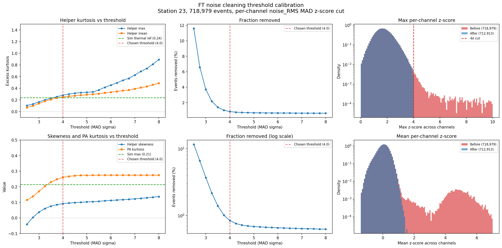

# FT noise cleaning

Forced-trigger (FT) events serve as the noise pool for simulations using measured noise (see `../simulate.py` with `--ft_noise_dir`). Non-thermal FT events need to be excluded so only thermal noise is injected.

This directory contains the cleaning pipeline that identifies and removes non-thermal FT events, plus the simulated thermal noise reference used to validate the cleaning threshold.

## Files

| File | Description |
|------|-------------|
| `generate_clean_mask.py` | Generates the clean event mask from FT feature data |
| `validate_threshold.py` | Sweeps cleaning thresholds and validates against simulated thermal reference |
| `analyze_sim_noise.py` | Computes per-channel RMS distribution stats from simulated thermal noise |
| `plot_flagged_waveforms.py` | Plots waveforms of flagged events for visual inspection |
| `clean_mask_station23.npz` | Output mask: 712,913 clean / 718,979 total events (99.16%) |
| `sim_noise_ref/` | Inputs for regenerating the simulated thermal noise reference (see below) |
| `figures/ft_cleaning_threshold_convergence.png` | Cleaning threshold sweep + before/after z-score distributions |

## Data sources

**FT feature data:** 718,979 FORCE trigger events from station 23, all 2022 runs (1-1135), extracted from handcarry data at `<data_dir>/handcarry/station23/`. Features were computed by the feature extraction pipeline use by the deep CR search with `--trigger_type FORCE`, producing 372 features per event including per-channel noise_RMS The merged output is at `<feature_output>/merged_feature_output.h5`.

**Simulated thermal noise:** 1000 events of pure thermal noise for station 23 generated through NuRadioMC's signal chain by Ruben Conceicao. The simulation uses per-channel effective noise temperatures and calibrated signal chain responses measured from 2023 data. The NUR file and the input files needed to reproduce it are in `sim_noise_ref/`.

## Simulated thermal noise reference

The `sim_noise_ref/` directory contains:

| File | Description |
|------|-------------|
| `eff_temperatures_calibrated_response_season2023_st23.json` | Per-channel effective noise temperatures (K) |
| `absolute_amplitude_calibration_season2023_st23_best_fit.csv` | Per-channel gain and response calibration parameters |

The effective temperatures were measured from 2023 data. To regenerate the 1000-event simulated noise NUR, run `simulate.py` in thermal mode with `noise_temperature: "detector"` in the config and pass `--noise_temperatures sim_noise_ref/eff_temperatures_calibrated_response_season2023_st23.json`. This overrides the DB's flat 300 K default with calibrated per-channel values. The DB does not currently store calibrated noise temperatures; this workaround will be unnecessary once they are added. See `analyze_sim_noise.py` for extracting per-channel RMS statistics from the NUR output.

## Cleaning method

For each of the 15 deep/helper channels (ch0-11, 21-23), compute the median and MAD (median absolute deviation) of noise_RMS across all 718,979 FT events. Convert MAD to Gaussian-equivalent sigma: `sigma = 1.4826 * MAD`. Flag any event where `(noise_RMS - median) / sigma > 4` on any channel. An event is removed from the clean pool if any single channel exceeds this threshold.

An earlier version used a composite flag based on 5 derived features plus a multi-channel RMS criterion. Visual inspection showed the extra features only added false positives (see `test_figs/`). The per-channel RMS cut alone is sufficient.

## Threshold calibration

The 4-sigma threshold is not arbitrary. It was calibrated by sweeping the threshold from 2.5 to 8 sigma and measuring the post-cut distribution shape (excess kurtosis, skewness) on the worst-affected channels (helper strings ch9-11, 21-23). The simulated thermal noise provides the reference: pure thermal noise through the NuRadioMC signal chain produces per-channel RMS distributions with excess kurtosis < 0.28 and skewness < 0.22.



| Threshold | Events removed | Helper max kurtosis | Converged to thermal? |
|-----------|---------------|--------------------|-----------------------|
| 2.5 sigma | 11.6% | 0.11 | Over-cut (negative skewness) |
| 3.0 sigma | 3.7% | 0.17 | Over-cut |
| 3.5 sigma | 1.4% | 0.23 | Marginal |
| **4.0 sigma** | **0.84%** | **0.28** | **Yes** |
| 4.5 sigma | 0.72% | 0.32 | Residual tails |
| 5.0 sigma | 0.69% | 0.33 | Residual tails |
| 8.0 sigma | 0.63% | 0.89 | Non-thermal |
| No cut | 0% | 463 | Non-thermal |

At 4 sigma, the post-cut kurtosis matches the simulated thermal reference. Tighter cuts over-sculpt (skewness goes negative). Looser cuts leave non-Gaussian tails.

## Clean mask format

The output `clean_mask_station23.npz` contains:

| Field | Type | Description |
|-------|------|-------------|
| `runNum` | int32 | Run number per event |
| `eventNum` | int32 | Event number per event |
| `is_clean` | int8 | 1 = clean (thermal), 0 = flagged (non-thermal) |

To exclude contaminated events from simulations, pre-filter the FT data directory or use the mask array programmatically before passing files to `noiseImporter`.

## Results

| Metric | Value |
|--------|-------|
| Total FT events (FORCE only, 2022) | 718,979 |
| Per-channel 4-sigma flagged | 6,066 (0.84%) |
| Clean events | 712,913 (99.16%) |

Per-channel breakdown of flagged events:

| Channel | Role | Flagged |
|---------|------|---------|
| ch0 | PA VPOL | 3,640 |
| ch1 | PA VPOL | 2,204 |
| ch21 | Helper C HPOL | 4,469 |
| ch22 | Helper C VPOL | 4,366 |
| ch10 | Helper B VPOL | 1,426 |
| ch23 | Helper C VPOL | 1,669 |
| ch11 | Helper B HPOL | 782 |

Helper/deep channels dominate the flagged population.

## Usage

```bash
# Generate the clean mask
python generate_clean_mask.py \
    --feature_file /path/to/merged_feature_output.h5 \
    --station_id 23

# Validate the threshold choice
python validate_threshold.py \
    --feature_file /path/to/merged_feature_output.h5 \
    --output_dir figures/

# Analyze simulated thermal noise reference
python analyze_sim_noise.py \

# Visually inspect flagged events
python plot_flagged_waveforms.py \
    --feature_file /path/to/merged_feature_output.h5 \
    --ft_dir /path/to/handcarry/station23 \
    --n_samples 20 \
    --output_dir test_figs/
```

## Known limitations

- **Station 23, 2022 only.** The included `clean_mask_station23.npz` covers station 23 FT data from 2022. Other stations and years require regenerating the mask from their own feature extraction output. Contamination rates will differ (stations closer to camp likely have higher RFI contamination).

- **Threshold calibrated against 2023-season simulated noise.** The 4-sigma threshold was validated using simulated thermal noise with effective temperatures measured from 2023 data. If the noise environment changes significantly between seasons, the threshold may need recalibration.

- **Requires external feature extraction.** The cleaning scripts operate on pre-extracted features (per-channel noise_RMS from the `gather_variables_noise.py` pipeline), not raw waveforms. The feature extraction pipeline is not included in NuRadioMC.

- **Per-channel RMS only.** The cleaning criterion uses per-channel noise_RMS and does not flag events with contamination that preserves the per-channel RMS (e.g., narrowband CW exactly at the thermal noise level). In practice, the 4-sigma cut captures all visually identifiable non-thermal events in the station 23 dataset.
