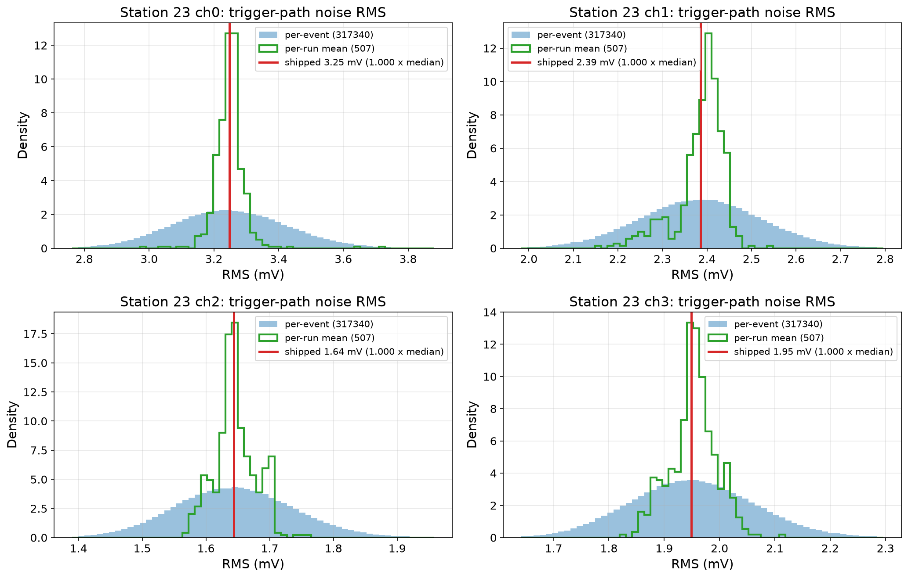

# Trigger-path Vrms extraction

FT noise is recorded through the readout signal chain (RADIANT). The trigger path (FLOWER) has a different signal chain after the 3 dB splitter (arXiv:2411.12922, Sec. 3.2), so the noise Vrms seen by the trigger differs from the readout Vrms. The simulation needs the trigger-path Vrms to set the trigger threshold properly.

`extract_trigger_vrms.py` measures the trigger-path Vrms by drawing FT events, applying the readout-to-trigger transfer function (from the detector description), and computing the per-channel RMS. The output YAML is passed to `simulate.py` via `--trigger_vrms`. Then, `triggerBoardResponse` uses the Vrms to select the VGA gain stage and digitize to 8-bit counts, and `highLowThreshold` converts the target trigger rate (1 Hz, ~3.76x the Vrms via `RNO_G_HighLow_Thresh`) into an ADC-count threshold.

## Shipped values

The number is the per-channel standard deviation of clean-masked real forced-trigger noise,
upsampled and tiled to the production trigger-copy geometry with the readout-to-trigger
transfer applied: the noise level the FLOWER trigger sees.

- `trigger_vrms_station{13,23}_calibrated.yaml`: `trigger_DB / readout_CALIBRATED` transfer;
  pair with the calibrated season-2022 readout detector description.
- `trigger_vrms_station{NN}.yaml`: `trigger_DB / readout_DB` transfer, 2022 pools. Caution:
  station 11's values were never independently extracted (identical to station 13);
  re-derive before use.

The measurement depends on the FT pool, the clean mask, and the detector-response vintage,
so it is epoch-specific: re-derive per station and epoch when any of those change, and do
not expect a re-measurement to reproduce the shipped values to the digit.



Each shipped value sits at the median of the measured per-event trigger-path RMS
distribution (station 23 shown; `plot_vrms_check.py --npz <measurement npz>
--vrms_yaml <yaml>` regenerates this from any measurement).

## Measuring trigger Vrms (production method)

Run per station and epoch when you need a fresh measurement (a new station, a new detector
response vintage, or a different FT pool). Full pool (recommended):

```bash
sbatch --export=ALL,STATION=23,MODE=ft,\
FT_NOISE_DIR=/path/to/forced_triggers/station23,\
CLEAN_MASK=/path/to/clean_mask_station23.npz,\
ENV_SETUP="source <conda.sh> && conda activate <env>",\
PYTHONPATH_ADD=/path/to/NuRadioMC_checkout_root submit_measure_vrms.sh
```

writes `trigger_vrms_station23_ft.npz` (per-event and per-run Vrms). The 200-realization
sampler is `measure_trigger_vrms.py --station 23 --ft_noise_dir <dir> --clean_mask <npz>`. Both
omit `--detector_file` to query MongoDB at `--event_time` (default 2022-10-01). Caveat: the
measurement depends on the FT pool, the clean mask, and the detector-response vintage, so it is
epoch-specific and will not reproduce the shipped production dicts exactly.

## Files

| File | Description |
|------|-------------|
| `trigger_vrms_station{NN}.yaml`, `..._calibrated.yaml` | Per-station trigger Vrms values (used by `simulate.py --trigger_vrms`) |
| `measure_trigger_vrms_full.py` | Full-pool trigger-Vrms measurement (production method); writes a per-station npz |
| `measure_trigger_vrms.py` | Sampled trigger-Vrms measurement |
| `submit_measure_vrms.sh` | SLURM wrapper for the full-pool measurement |
| `plot_vrms_check.py` | Plots a shipped YAML value against the measured per-event distribution (reads the measurement npz + a vrms YAML) |
| `extract_trigger_vrms.py` | Transfer-function estimate; superseded by the measurement scripts, which measure the injected noise directly |
| `vrms_convergence_study.py` | Sweeps N to determine how many FT events are needed for stable Vrms |

## Usage

```bash
# Measure trigger Vrms (run once per station/detector/FT dataset)
python measure_trigger_vrms.py \
    --station 23 \
    --ft_noise_dir /path/to/forced_triggers/station23 \
    --clean_mask /path/to/clean_mask_station23.npz

# Use in simulation
python ../../simulate.py \
    --trigger_vrms trigger_vrms_station23.yaml \
    --ft_noise_dir /path/to/forced_triggers/station23 \
    ...
```

## Convergence study

`vrms_convergence_study.py` measures the Vrms at several N values with multiple random seeds to quantify how many FT events are needed for the per-channel Vrms to stabilize. Supports SLURM array parallelization via `--chunk_id` / `--n_chunks`.

```bash
# Serial
python vrms_convergence_study.py \
    --ft_noise_dir /path/to/forced_triggers/station23 \
    --n_repeats 10 --outdir .

# Parallel (SLURM array)
#SBATCH --array=0-9
python vrms_convergence_study.py \
    --ft_noise_dir /path/to/forced_triggers/station23 \
    --n_repeats 10 --outdir . \
    --chunk_id $SLURM_ARRAY_TASK_ID --n_chunks 10

# Merge chunks
python vrms_convergence_study.py --merge --outdir .
```

### Results (station 23, 2022 FT data, 10 repeats per N)

| N | ch0 (mV) | ch1 (mV) | ch2 (mV) | ch3 (mV) | Worst-channel spread |
|---|----------|----------|----------|----------|---------------------|
| 10 | 4.33 +/- 0.09 | 5.19 +/- 0.15 | 4.25 +/- 0.12 | 2.98 +/- 0.07 | 2.9% |
| 25 | 4.31 +/- 0.07 | 5.10 +/- 0.07 | 4.26 +/- 0.09 | 2.98 +/- 0.03 | 2.1% |
| 50 | 4.34 +/- 0.08 | 5.13 +/- 0.08 | 4.27 +/- 0.09 | 3.02 +/- 0.04 | 2.2% |
| **100** | **4.32 +/- 0.04** | **5.10 +/- 0.05** | **4.21 +/- 0.04** | **3.01 +/- 0.02** | **1.0%** |
| 200 | 4.32 +/- 0.02 | 5.12 +/- 0.03 | 4.21 +/- 0.03 | 3.01 +/- 0.02 | 0.8% |
| 500 | 4.32 +/- 0.01 | 5.11 +/- 0.02 | 4.23 +/- 0.02 | 3.01 +/- 0.01 | 0.5% |

The means converge by N=25. The spread drops below 1% at N=100, which is the default for `extract_trigger_vrms.py`.

## Known limitations

- The readout-to-trigger transfer function comes from the detector description. If the detector description is inaccurate, the Vrms will be too.
- The VGA gain selection in `triggerBoardResponse` does not match the real FLOWER hardware, so the relationship between the measured Vrms and the actual trigger behavior is approximate.
  - The real FLOWER board has a 14-stage VGA that auto-selects gain so noise fills ~5 ADC counts on its 8-bit digitizer. `triggerBoardResponse` replicates this, but for the same input Vrms it picks a systematically lower gain stage than the real board (compared against gain codes from `aux/flower_gain_codes.0.txt`). The cause is unknown. This means the digitized amplitude scaling in the simulation differs from real hardware, so the ADC-count threshold doesn't map to the same physical voltage threshold as on the real board.
- Results are specific to the station, detector description, and FT data used. Re-extract when any of these change.
