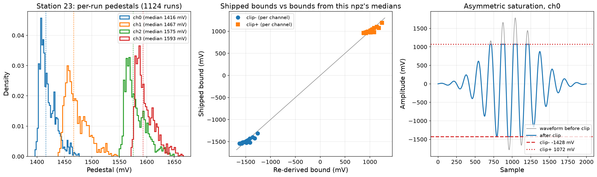

# Pedestal extraction: per-channel ADC clip thresholds

The RADIANT 12-bit ADC digitizes over a 0-2.5 V range (4096 counts). The pedestal (DC baseline) sits at approximately 1.5 V, not the 1.25 V midpoint. This makes the effective dynamic range asymmetric: signals can swing further negative (~1.5 V headroom) than positive (~1.0 V headroom) before clipping.

`simulate.py` applies this clip in the readout resampler. Per-channel bounds come from
`--clip_thresholds <yaml>` (`{ch: [lo_mV, hi_mV]}`); with no file it falls back to a single
uniform range built from the scalar `--pedestal_voltage`, an approximation.

## Shipped values

The number is the per-channel pedestal position in the 0-2500 mV RADIANT range, turned into
asymmetric saturation bounds (`clip- = -pedestal`, `clip+ = 2500 - pedestal`). The shipped
`clip_thresholds_station{11,12,13,21,22,23,24}.yaml` carry per-station bounds from measured
2022 pedestals; the pedestal source per station is recorded in each file's metadata.
Pedestals drift, so re-derive for a new station or epoch with `pedestal_analysis.py`.



Left: the per-run pedestal distributions the bounds derive from (station 23). Middle:
shipped bounds against bounds re-derived from a fresh pedestal extraction, agreeing to a
few percent (extraction-vintage drift). Right: the asymmetric saturation the bounds
produce. `plot_clip_check.py --npz <pedestal npz> --clip_yaml <yaml>` regenerates this.

## Files

| File | Description |
|------|-------------|
| `clip_thresholds_station{NN}.yaml` | Per-station clip thresholds (used by `simulate.py --clip_thresholds`) |
| `pedestal_analysis.py` | Re-derives per-channel pedestal voltages / clip thresholds from pedestal.root files; writes `pedestal_analysis_results.npz` (per-run, per-channel pedestals) |
| `plot_clip_check.py` | Plots the shipped bounds against the measured pedestal distributions (reads the npz above + a clip YAML) |

## Method

Each RNO-G run includes a pedestal measurement that records the ADC pedestal distribution (4096 bins) for all 24 channels. The script:

1. Crawls a data directory for `run*/pedestal.root` files
2. Extracts the mean pedestal (in ADC counts, converted to mV) per channel per run
3. Optionally filters by year using the UTC timestamp in the ROOT file
4. Computes the median pedestal across all qualifying runs for each channel
5. Derives asymmetric clip thresholds: `clip_negative = -median`, `clip_positive = 2500 - median` (in mV)

## Usage

```bash
# Extract thresholds for 2022 (requires pedestal data and SLURM)
python pedestal_analysis.py \
    --data_dir /path/to/station23/ \
    --station_id 23 \
    --year 2022 \
    --outdir .

# Use in the CR proxy simulation
python ../simulate.py \
    ... \
    --pedestal_voltage 1.5
```

The script uses `joblib` for parallel processing of ROOT files. Run with `--cpus-per-task=20` on SLURM for the full 6,849-file dataset.

## Known limitations

- **Single median per channel.** Pedestals drift over time, so the script uses `--year` to restrict to a single year. However, even within a year some channels show run-to-run variation that a single median doesn't capture.

- **No database integration.** The RNO-G MongoDB does not currently store `adc_pedestal_voltage`. Pedestals must be set at runtime via `--pedestal_voltage` (single value) or `set_pedestal_voltage(dict)` (per-channel). Adding this field to the DB would allow automatic pedestal loading.