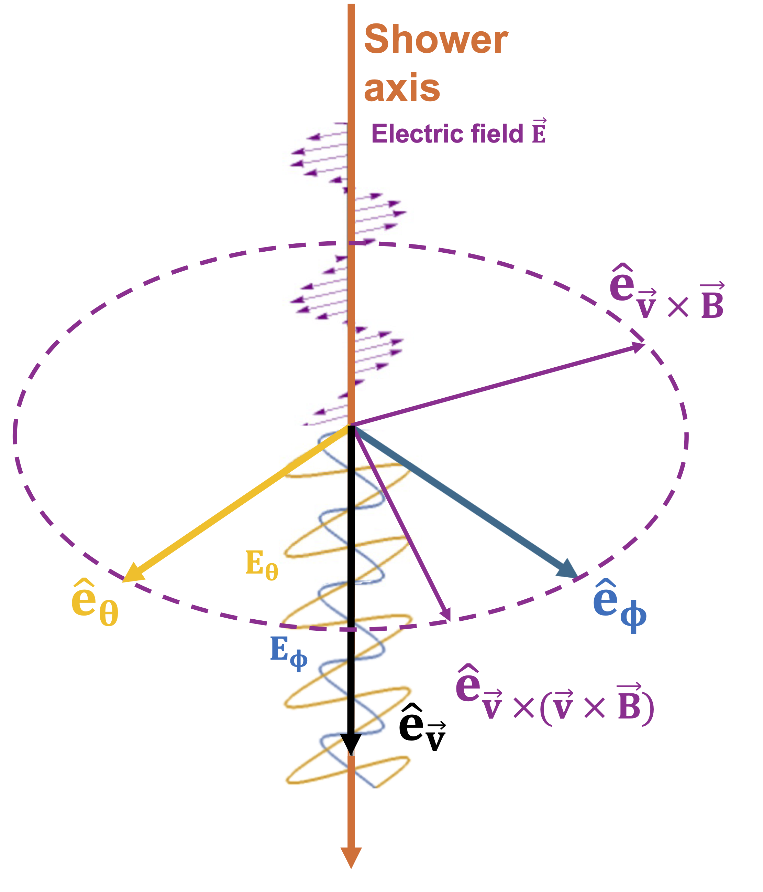
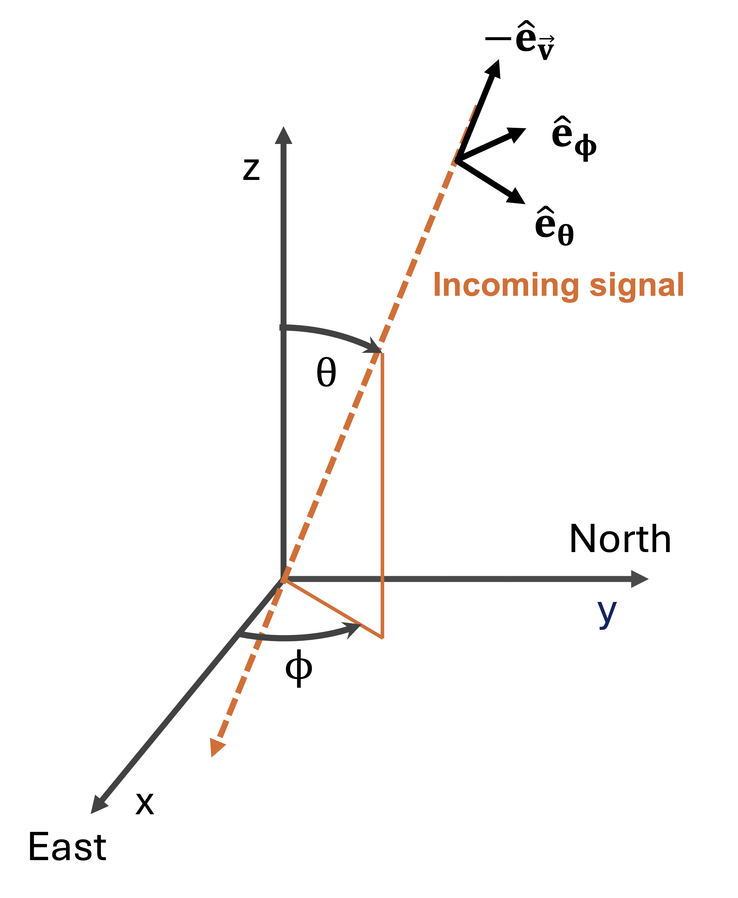

Some notes on conventions
=========================

Coordinates
-----------

Default coordinate system
_________________________
NuRadioMC uses a local cartesian coordinate system. 
The origin is at the surface, where the x axis is towards Easting, the y axis towards Northing, and the z axis upwards. 

Points
______
All points (e.g. antenna positions) are specified with respect to the coordinate origin. 
The position (0,0,0) is at the surface and x = 0, y = 0 is typically at the center of the station. 

Angles
______
The zenith/theta angle is defined with respect to z axis, i.e. 

* 0 deg = upwards
* 90deg = towards horizon
* 180 deg = downwards. 

The azimuth/phi angle is counting northwards from East.

Directions
__________

All direction are pointing to "where it came from", i.e. opposite to the direction of propagation. E.g. 

* 0 deg zenith angle = coming from above = propagating downwards
* 180 deg zenith angle = coming from below = propagating upwards (through the Earth)

Exception: The ``launch_vector``, the direction to which the Askaryan signal is emitted to reach the antenna, 
is defined into the direction of propagation. 

Electic Fields
______________

The electric field is stored in 'on-sky' polar coordinates with (r, :math:`e_\theta`, :math:`e_\phi`) as the components. r is usually small.

Left: Comparison of the coordinate systems important for the polarization of the electic fiel. The orange arrow indicates the shower axis, the purple circle indicates the shower plane. The natural coordinate system for the air shower electric field is given by :math:`\hat{e}_{\vec{v}}`, :math:`\hat{e}_{\vec{v} \times \vec{B}}` and :math:`\hat{e}_{\vec{v} \times \vec{v} \times \vec{B}}`. On ground, a coordinate system with respect to arrival direction is useful, given by :math:`\hat{e}_{\vec{v}}`, :math:`\hat{e}_\theta`, :math:`\hat{e}_\phi`. Therefore the electric field has the components :math:`E_\theta`, :math:`E_\phi`. Both coordinate systems share :math:`\hat{e}_{\vec{v}}`. Right: 'On-sky' coordinate system as seen from ground. The x-axis is pointing east, the y-axis to the north. The incoming signal corresponds to the air shower axis. :math:`\hat{e}_{\vec{v}}`, :math:`\hat{e}_\theta`, :math:`\hat{e}_\phi` are the same as left.

Units
-----
Physical quantities in ``NuRadioMC`` use Auger base units. To print, plot and convert dimensional quantities,
a convenient module is included in ``NuRadioReco``. Details are given :ref:`here <NuRadioReco/pages/utilities:Unit System>`.

Particle types
--------------
Particle types are encoded using the `PDG convention <https://pdg.lbl.gov/2007/reviews/montecarlorpp.pdf>`_.
The most relevant particle ids for us are [12,14,16] for the electron, muon and tau neutrino, respectively, 
with an overall minus sign indicating their corresponding anti-particles. A more extensive overview is included 
as a table in the :ref:`event generation manual <particle-code-table>`.

Fourier transformations
-----------------------
To ensure Fourier transforms have the correct units, please use the convenience functions provided
in NuRadioReco detailed :ref:`here <NuRadioReco/pages/utilities:Fourier Transformation>`.